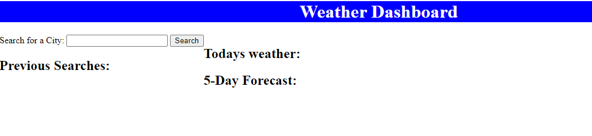
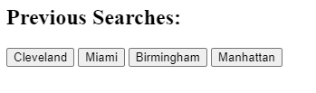
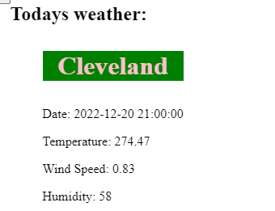

# weather-dashboard

## Project Description

This is a project used to incorporate a weather API and create a front-end dashboard to show the relevant information. The dashboard
allows a user to search a city and then the current day and five day forecast will show up.

There also is a search history section that allows the user to go back and click a city that was previously searched.

## Tools Used to Create This Project

* HTML
* CSS
* JavaScript
* API

## Link To Deployed Application

You can access the application at:

https://bsovic23.github.io/weather-dashboard/

## Future Work

* I would like to clean up/make the design and UI more interactive
    - Clean up repeat search history button
    - Add more color
    - Enhance buttons/sections

* I would also like to clean up the JavaScript code to make it cleaner/remove code to replace with more efficient coding
    - Lengthy div box creation for cities replaced with Jquery ${} to manipulate DOM elements

## Screenshots

